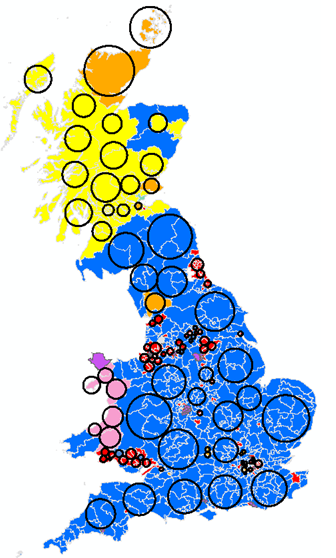

<style type="text/css">

h1.title {
  font-size: 26px;
  line-height: 130%;
  color: Black;
  text-align: center;
}

h2.subtitle {
  font-size: 13px;
  line-height: 120%;
  color: Black;
  text-align: center;
}

h4.author { /* Header 4 - and the author and data headers use this too  */
  font-size: 17px;
  font-family: "Arial";
  color: Black;
  text-align: center;
}
h4.date { /* Header 4 - and the author and data headers use this too  */
  font-size: 17px;
  font-family: "Arial", Times, serif;
  color: Black;
  text-align: center;
}

h4.abstract { /* Header 4 - and the author and data headers use this too  */
  font-size: 10px;
  font-family: "Arial", Times, serif;
  color: black;
  text-align: center;
}

h4.institute{ /* Header 4 - and the author and data headers use this too  */
  font-size: 10px;
  font-family: "Arial", Times, serif;
  color: black;
  text-align: center;
}

body, td {
   font-size: 14px;
}
code.r{
  font-size: 13px;
}
pre {
  font-size: 13px
}
h1 { /* Header 1 */
  font-size: 16px;
  color: DarkBlue;
}
h2 { /* Header 2 */
    font-size: 16px;
  color: DarkBlue;
}
h3 { /* Header 3 */
  font-size: 15px;
  font-family: "Times New Roman", Times, serif;
  color: DarkBlue;

</style>

```{r setup, include = FALSE}
knitr::opts_chunk$set(
  collapse = TRUE,
  comment = "#>"
)
```

```{r functions, include=FALSE}
# A function for captioning and referencing images
fig <- local({
    i <- 0
    ref <- list()
    list(
        cap=function(refName, text) {
            i <<- i + 1
            ref[[refName]] <<- i
            paste("Figure ", i, ": ", text, sep="")
        },
        ref=function(refName) {
            ref[[refName]]
        })
})
```

# Introduction

Longitudinal 

```{r, echo=FALSE, include=FALSE}
library(rtweet)
library(ggplot2)
library(dplyr)
library(tidytext)
library(twitteR)
library(ROAuth)
library(NLP)
library(twitteR)
library(syuzhet)
library(tm)
library(SnowballC)
library(stringi)
library(topicmodels)
library(lubridate)
```

#Experimental design

#use the bing lexicon.
```{r, echo=FALSE, include=FALSE}

```


```{r figs1, echo=FALSE, fig.cap=fig$cap("figs1", "Data Collection Design"), out.width = '60%', fig.align="center"} 

```

#Materials:
1. textmining and sentiment analysis
https://www.tidytextmining.com/sentiment.html

All three of these lexicons are based on unigrams, i.e., single words. These lexicons contain many English words and the words are assigned scores for positive/negative sentiment, and also possibly emotions like joy, anger, sadness, and so forth. The nrc lexicon categorizes words in a binary fashion ("yes"/"no") into categories of positive, negative, anger, anticipation, disgust, fear, joy, sadness, surprise, and trust. The bing lexicon categorizes words in a binary fashion into positive and negative categories. The AFINN lexicon assigns words with a score that runs between -5 and 5, with negative scores indicating negative sentiment and positive scores indicating positive sentiment. All of this information is tabulated in the sentiments dataset, and tidytext provides a function get_sentiments() to get specific sentiment lexicons without the columns that are not used in that lexicon.


