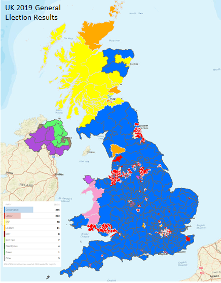
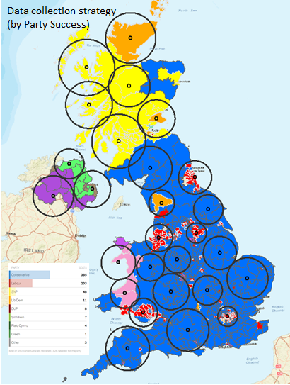
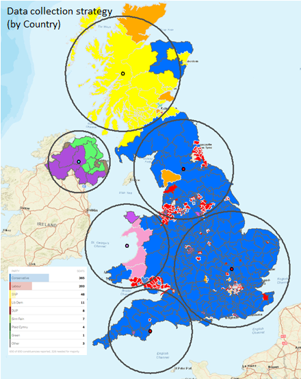

<style type="text/css">

h1.title {
  font-size: 26px;
  line-height: 130%;
  color: Black;
  text-align: center;
}

h2.subtitle {
  font-size: 13px;
  line-height: 120%;
  color: Black;
  text-align: center;
}

h4.author { /* Header 4 - and the author and data headers use this too  */
  font-size: 17px;
  font-family: "Arial";
  color: Black;
  text-align: center;
}
h4.date { /* Header 4 - and the author and data headers use this too  */
  font-size: 17px;
  font-family: "Arial", Times, serif;
  color: Black;
  text-align: center;
}

h4.abstract { /* Header 4 - and the author and data headers use this too  */
  font-size: 10px;
  font-family: "Arial", Times, serif;
  color: black;
  text-align: center;
}

h4.institute{ /* Header 4 - and the author and data headers use this too  */
  font-size: 10px;
  font-family: "Arial", Times, serif;
  color: black;
  text-align: center;
}

body, td {
   font-size: 14px;
}
code.r{
  font-size: 13px;
}
pre {
  font-size: 13px
}
h1 { /* Header 1 */
  font-size: 16px;
  color: DarkBlue;
}
h2 { /* Header 2 */
    font-size: 16px;
  color: DarkBlue;
}
h3 { /* Header 3 */
  font-size: 15px;
  font-family: "Times New Roman", Times, serif;
  color: DarkBlue;

</style>

```{r setup, include = FALSE}
knitr::opts_chunk$set(
  collapse = TRUE,
  comment = "#>"
)
```

```{r functions, include=FALSE}
# A function for captioning and referencing images
fig <- local({
    i <- 0
    ref <- list()
    list(
        cap=function(refName, text) {
            i <<- i + 1
            ref[[refName]] <<- i
            paste("Figure ", i, ": ", text, sep="")
        },
        ref=function(refName) {
            ref[[refName]]
        })
})
```

# Introduction

Twitter provides us with vast amounts of user-generated language data - a dream for anyone wanting to conduct textual analysis. More than that, tweets allow us to gain insights into the online public behaviour. As such, analysing Twitter has become a crucial source of information for brands and agencies.
Several factors have given Twitter considerable advantages over other social media platforms for analysis. First, the limited character size of tweets provides us with a relatively homogeneous corpora. Second, the millions of tweets published everyday allows access to large data samples. Third, the tweets are publicly available and easily accessible as well as retrievable via APIs


```{r, echo=FALSE, include=FALSE}
library(rtweet)
library(ggplot2)
library(dplyr)
library(tidytext)
library(twitteR)
library(ROAuth)
library(NLP)
library(twitteR)
library(syuzhet)
library(tm)
library(SnowballC)
library(stringi)
library(topicmodels)
library(lubridate)
library(stringr)
```

# Research objectives

1. To analyse the political sentiments around `Brexit` before and after the 31st Jan. 2020 (`Brexit date`).

2. To examine whether the political sentiments bear any associations with political control (i.e. party) of the geographical regions (using the Dec. 2019 general election results).

# Data download strategy

The Twitter API is used to download tweets from different geographical areas across the UK. Figure `r fig$ref("figs1")`, Figure `r fig$ref("figs2")`, Figure `r fig$ref("figs2")` shows the data download strategy, which involves drawing sets of circles over areas that are now controlled by different political parties based on the last general elections (held on the 12th Dec. 2019). This enables us to download tweets that were tweeted in different areas across the country. Owing to the twitter download constraints, we randomly pick 12 circles from each political area each day and download all tweets that include the keywords `#Brexit` or `brexit`. The download covers from `Jan 1, 2020` to `Feb 29, 2020`. Table xx shows the total number tweets downloaded for each political area over the study period.   

```{r figs1, echo=FALSE, fig.cap=fig$cap("figs1", "UK 2019 General Election Results"), out.width = '60%', fig.align="center"} 

```

```{r figs2, echo=FALSE, fig.cap=fig$cap("figs1", "Data download strategy (by party success)"), out.width = '60%', fig.align="center"} 

```

```{r figs3, echo=FALSE, fig.cap=fig$cap("figs1", "Data download strategy (by Country)"), out.width = '60%', fig.align="center"} 

```

```{r, echo=FALSE, include=FALSE}
require(knitr)
library(flextable)
library(kableExtra)
library(plyr) 
library(textclean)
```


```{r, echo=FALSE, include=FALSE}
col1 <- c("1", "2","3","4", "5")
col2 <- c("xx","xx", "xx", "`xx`","`xx`")
col3 <- c("xx", "xx", "xx", "xx","xx")
col4 <- c("xx","xx", "xx", "xx","xx")
tble <- data.frame(col1, col2, col3, col4)
tble <- tble
```

```{r table1, results='asis', echo=FALSE, tidy.opts=list(width.cutoff=50)}
knitr::kable(tble, caption = "Table 1. `Data manipulation` functions", col.names = c("SN","Function","Title","Description")) %>%
  kable_styling(full_width = F) %>%
  column_spec(1, bold = T, border_right = T) %>%
  column_spec(2, width = "8em", background = "white") %>%
  column_spec(3, width = "12em", background = "white") %>%
  column_spec(4, width = "16em", background = "white")#%>%
  #row_spec(3:5, bold = T, color = "white", background = "#D7261E")
```

# Data exploration

```{r}
# #read-in data
# 
# #append all downloaded data set
# #polit_tweets_ <- read.csv(file="C:/Users/monsu/Documents/GitHub/Sentiment-analysis/downloads/download_2020-01-10_to_2020-01-11_Others.csv", sep=",", head=TRUE)
# 
# filenames <- list.files(path = "C:/Users/monsu/Documents/GitHub/Sentiment-analysis/downloads/", pattern = "*", full.names=TRUE)
# polit_tweets_ <- ldply(filenames, read.csv)
# #head(polit_tweets_)

```


```{r}
# # Remove retweets 
# polit_tweets_organic <- polit_tweets_[polit_tweets_$isRetweet==FALSE, ] 
# #head(polit_tweets_organic)
# nrow(polit_tweets_organic)
# 
# # Remove replies
# polit_tweets_organic <- subset(polit_tweets_organic, is.na(polit_tweets_organic$replyToSID)) 
# 
# #remove 'https:/....'
# polit_tweets_organic <- polit_tweets_organic %>% 
#     mutate(day=as.Date(as.character(substr(created,1,10)), format = "%d")) %>%
#     mutate(text=str_replace_all(text, "[[:punct:]]", " ")) %>%
#     mutate(text = gsub("http://*|https://*|https*|\n*|*>|<*","", text))
#   
# #convert to data.frame
# #polit_tweets <- data.frame(polit_tweets)
# 
# #remove emoticons
# polit_tweets_organic$text <- sapply(polit_tweets_organic$text,function(row) iconv(row, "latin1", "ASCII", sub=""))
# #head(polit_tweets_organic)
# nrow(polit_tweets_organic)

```


```{r}
# #remove duplicate tweets..
# data("stop_words")
# 
# # get a list of words
# polit_tweets_organic_clean <- polit_tweets_organic %>%
#   dplyr::select(text, day, party_area) %>%
#   unnest_tokens(word, text) %>%
#   anti_join(stop_words) %>%
#   filter(!word %in% c("rt", "t.co"))
# 
# #head(polit_tweets_organic_clean)
# dim(polit_tweets_organic_clean)
# #polit_tweets_organic_clean[order(polit_tweets_organic_clean$word),]

```


```{r}
# # plot the top 15 words -
# polit_tweets_organic_clean %>%
#   dplyr::count(word, sort = TRUE) %>%
#   top_n(20) %>%
#   mutate(word = reorder(word, n)) %>%
#   ggplot(aes(x = word, y = n)) +
#   geom_col() +
#   xlab(NULL) +
#   coord_flip() +
#   labs(x = "Count",
#        y = "Unique words",
#        title = "Count of unique words found in tweets")

```

Next, join the words extracted from the tweets with the sentiment data. The "bing" sentiment data classifies words as positive or negative. In order to use other sentiment lexicons see [here](https://www.tidytextmining.com/sentiment.html#the-sentiments-dataset).

```{r}
# # join sentiment classification to the tweet words
# bing_word_counts <- polit_tweets_organic_clean %>%
#   inner_join(get_sentiments("bing")) %>%
#   dplyr::count(word, sentiment, party_area, sort = TRUE) %>%
#   group_by(sentiment) %>%
#   ungroup() %>%
#   mutate(word = reorder(word, n)) %>%
#   group_by(sentiment) %>%
#   top_n(n = 5, wt = n) %>%
#   # create a date / sentiment column for sorting
#   mutate(senti_party = paste0(sentiment,"-", party_area)) %>%
#   arrange(party_area, desc(sentiment), n)
# 
# head(bing_word_counts)
```


```{r}
# bing_word_counts$senti_party <- factor(bing_word_counts$senti_party,
#        levels = unique(bing_word_counts$senti_party))
# 
# # group by month and sentiment and then plot top 5 words each month
# bing_word_counts %>%
#   ggplot(aes(word, n, fill = sentiment)) +
#   geom_col(show.legend = FALSE) +
#   facet_wrap(~senti_party, scales = "free_y", ncol = 2) +
#   labs(title = "Positive and negative sentiment across different areas",
#        y = "Number of Times Word Appeared in Tweets",
#        x = NULL) +
#   coord_flip()
```

```{r}


```


# Sentiment analysis

```{r}
#read-in data

```


#Materials:
1. textmining and sentiment analysis
https://www.tidytextmining.com/sentiment.html

All three of these lexicons are based on unigrams, i.e., single words. These lexicons contain many English words and the words are assigned scores for positive/negative sentiment, and also possibly emotions like joy, anger, sadness, and so forth. The nrc lexicon categorizes words in a binary fashion ("yes"/"no") into categories of positive, negative, anger, anticipation, disgust, fear, joy, sadness, surprise, and trust. The bing lexicon categorizes words in a binary fashion into positive and negative categories. The AFINN lexicon assigns words with a score that runs between -5 and 5, with negative scores indicating negative sentiment and positive scores indicating positive sentiment. All of this information is tabulated in the sentiments dataset, and tidytext provides a function get_sentiments() to get specific sentiment lexicons without the columns that are not used in that lexicon.


